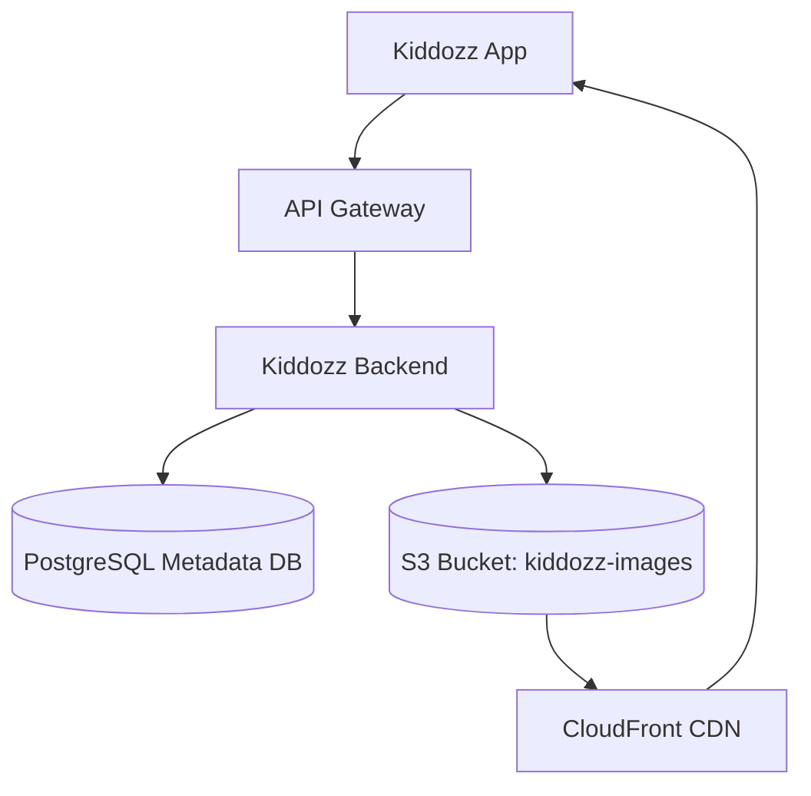
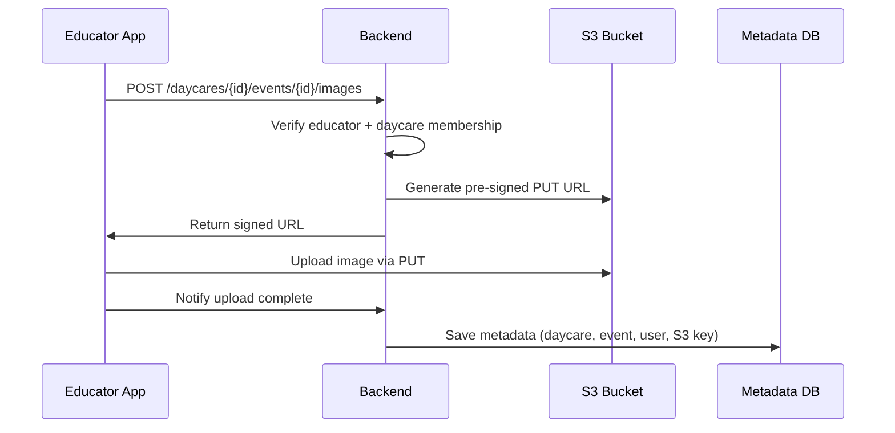
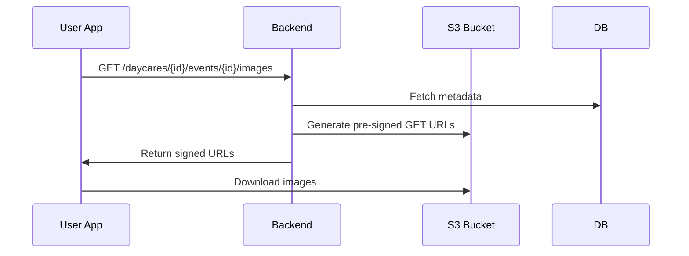
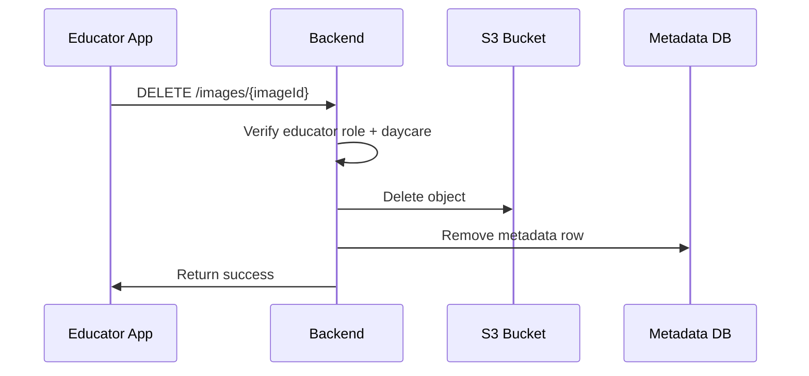

# Kiddozz Image Storage Architecture

## Overview
This document describes the **secure and scalable image storage architecture** for the Kiddozz application. The design balances:
- **Data protection** (GDPR-compliant handling of children’s data).
- **Scalability** (supporting 100+ daycares and tens of thousands of users).
- **Reliability** (images never disappear unexpectedly).

Images will be stored in **AWS S3**, with access controlled via **pre-signed URLs** generated by the backend. Metadata (ownership, daycare/event mapping) is stored in **PostgreSQL**.

---

## High-Level Architecture



### Components
- **Kiddozz App**: Android/iOS client.
- **Backend**: Issues pre-signed URLs, enforces access rules, stores metadata.
- **PostgreSQL**: Metadata DB storing daycare → event → child → image references.
- **S3 (AWS EU region)**: Stores all uploaded images.
- **CloudFront (optional)**: CDN for fast and secure delivery.

---

## Bucket Structure

Instead of one bucket per daycare, we use **a single global bucket** per environment with logical separation via prefixes:

```
s3://kiddozz-images/daycare-{daycareId}/event-{eventId}/child-{childId}/image-{imageId}.jpg
```

Benefits:
- Easier to scale (no bucket sprawl).
- Access isolation via object prefixes.
- Single policy to manage.

---

## Roles & Permissions

### Educator
- **Upload**: Allowed via pre-signed PUT URLs.
- **Delete**: Allowed (verified via backend).
- **View**: Allowed for their daycare’s events.

### Parent
- **Upload**: Not allowed in phase 1 (future: upload with educator approval).
- **Delete**: Not allowed.
- **View**: Allowed for their own child’s events.

---

## Image Upload Flow



---

## Image View Flow



---

## Image Delete Flow



---

## Security Measures
- **S3 buckets are private** (no public ACLs).
- **Encryption at rest**: Enabled via AWS SSE-S3 or SSE-KMS.
- **Encryption in transit**: HTTPS enforced.
- **Access** only through pre-signed URLs from backend.
- **Postgres metadata** ensures strict daycare-to-image mapping.
- **Audit logs**: Track who uploaded or deleted images.

---

## Future Enhancements
- **Parent uploads with approval**: Store pending uploads in DB, educators approve before PUT URL is issued.
- **Child tagging**: Parents only see images tagged with their child.
- **CloudFront signed cookies/URLs**: Faster delivery with same security.
- **Versioning & backup**: Enable S3 versioning for rollback.

---

## Summary
- **1 global S3 bucket** with prefix-based separation for each daycare.
- **Backend-controlled access** using pre-signed URLs.
- **PostgreSQL metadata DB** ensures isolation & mapping.
- **Scalable** to 100+ daycares, 40k+ users, millions of images.
- **GDPR-compliant** storage in EU region with encryption.
